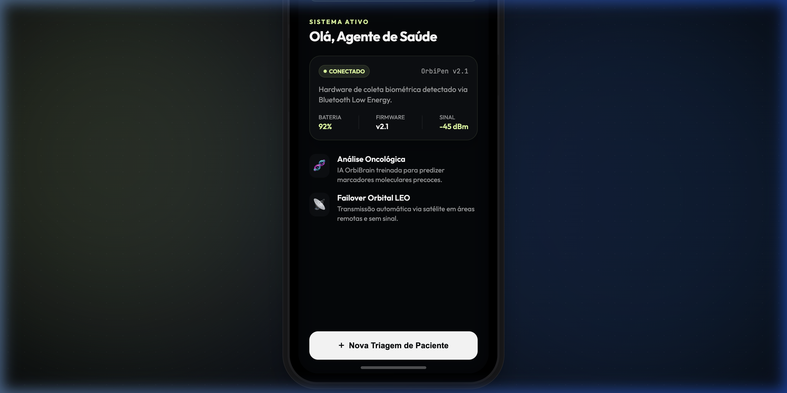
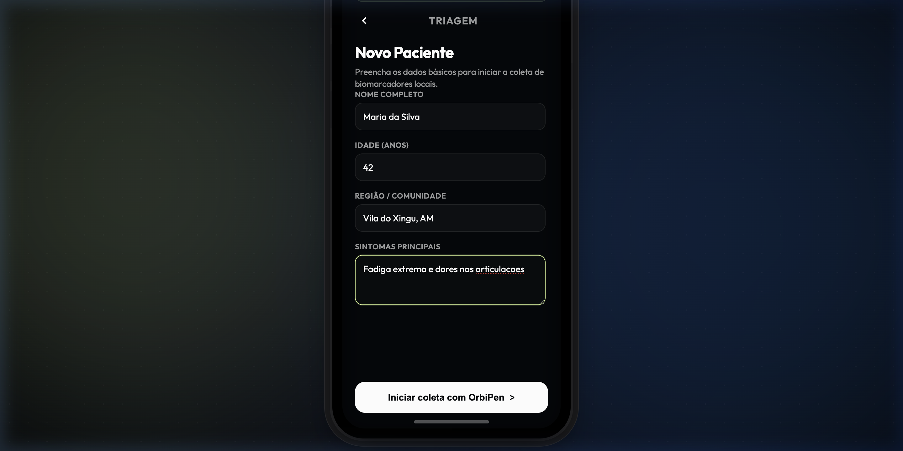
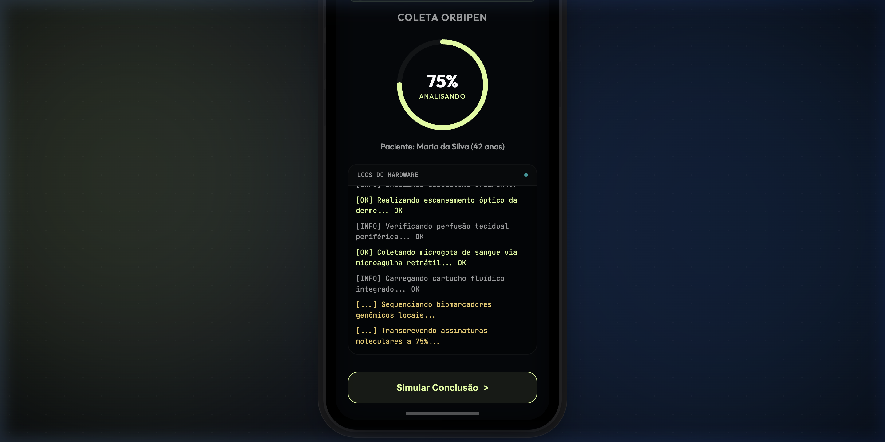
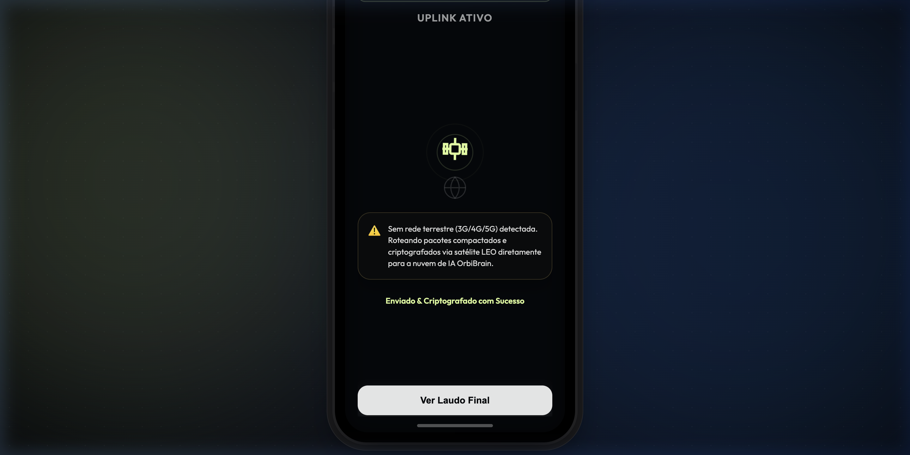
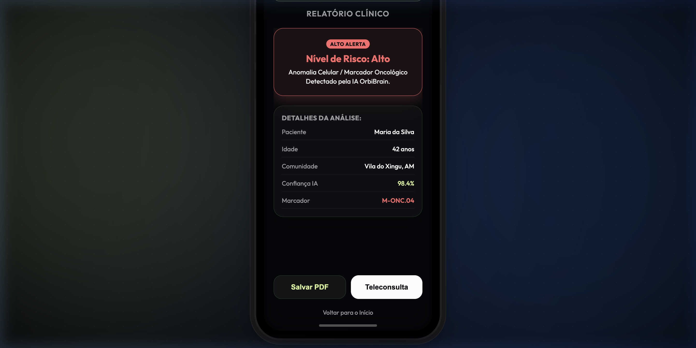
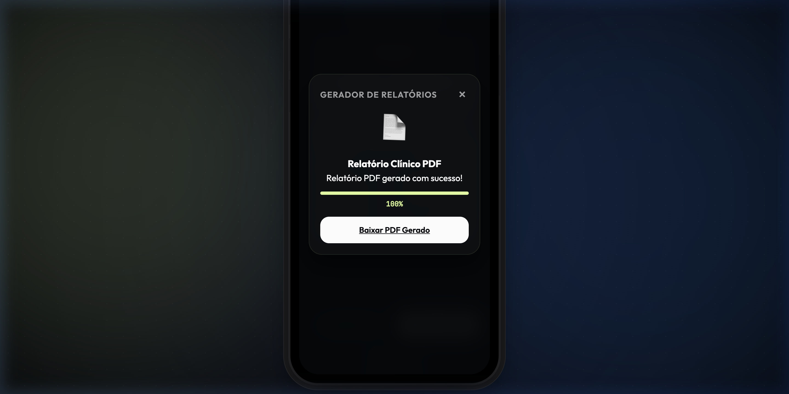
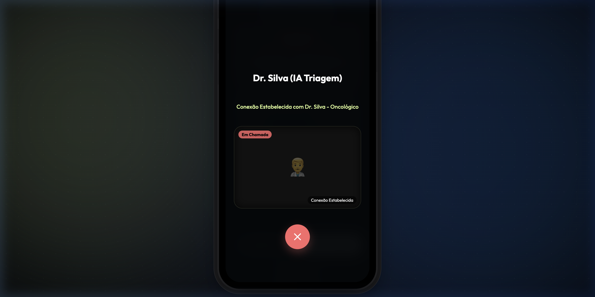

# 🛰️ OrbiMed — Ecossistema de Saúde Preditiva Orbital

> **Global Solution 2026** — FIAP (Tecnologia em Análise e Desenvolvimento de Sistemas)
>
> 🔗 **Protótipo Interativo Web:** [👉 Clique aqui para testar o App em tempo real na Vercel](https://orbi-med.vercel.app/)
>
> 🔗 **Vídeo Pitch (3 Minutos):** [🎥 Assistir à apresentação no YouTube](https://youtube.com/seu-link-do-pitch)

---

## 📝 Visão Geral do Projeto

O **OrbiMed** é um ecossistema de saúde híbrido desenvolvido para mitigar o **Vazio Assistencial** em áreas geograficamente isoladas (como comunidades ribeirinhas, rurais e florestais) que carecem de infraestrutura médica e conectividade terrestre (3G/4G/5G).

Inspirado em tecnologias de miniaturização de laboratórios do **Programa Artemis da NASA**, o ecossistema é composto por:

1. **OrbiPen:** Um hardware médico portátil (IoT) de triagem molecular e óptica.
2. **OrbiMed App:** Aplicativo móvel que gerencia os exames e realiza a ponte de conectividade.
3. **OrbiBrain:** Inteligência Artificial na nuvem que processa sequenciamentos genômicos e emite laudos síncronos em minutos.

---

## 🛠️ O Diferencial Técnico: Conectividade Híbrida LEO

O grande trunfo do software é o seu modelo **Hybrid-First**. Caso o Agente de Saúde Comunitário esteja operando em uma zona de exclusão digital (sem sinal de celular), o aplicativo compacta os dados clínicos em JSON, aplica criptografia **AES-256** e realiza um **failover automático para canais satelitais de Órbita Baixa (LEO)**.

Os dados são ingeridos por um gateway de alta performance em **Golang**, processados pelo motor de IA em **Python**, e o laudo médico preditivo é retornado diretamente para o dispositivo em campo.

---

## 📱 Interface do Usuário & Jornada do App

O protótipo simula com fidelidade o design de um aplicativo de iPhone operando em modo **Dark Mode Premium** (fundo azul-escuro profundo `#05070a` e acentos em verde-tecnológico `#deff9a`). A navegação reage em tempo real com lógica de estados e feedback dinâmico via **Dynamic Island**.

### 📸 Demonstração das Telas

| 1. Dashboard Principal (Home) | 2. Cadastro de Paciente | 3. Execução do Exame |
| :---: | :---: | :---: |
|  |  |  |
| Status da bateria do OrbiPen e indicador de satélite ativo. | Campos clínicos rápidos para triagem em comunidades isoladas. | Progresso radial interativo sincronizado com logs de hardware. |

| 4. Uplink Espacial (LEO) | 5. Laudo Clínico Final |
| :---: | :---: |
|  |  |
| Transmissão criptografada via failover satelital ativo. | Laudo emitido pelo OrbiBrain com alerta de alto risco. |

### 🛠️ Novas Simulações da Tela Final

| Geração de Relatório PDF | Teleconsulta de Urgência |
| :---: | :---: |
|  |  |
| Progresso de criptografia local 0-100% que gera um documento de texto formatado para download. | Discador com ondas pulsantes e abertura de transmissão de vídeo simulada após 2.5s. |

---

## 🎥 Demonstração em Vídeo (Pitch)

Confira a apresentação curta do projeto (limite rigoroso de 3 minutos), detalhando o modelo de negócios B2G/ESG alinhado aos **ODS 3, 9 e 11 da ONU**:

*Clique na imagem acima para assistir à demonstração completa e defesa da arquitetura no YouTube.*

---

## 🏗️ Stack Tecnológica do Protótipo

- **Interface & Estrutura:** HTML5 / CSS3 (Design Responsivo Mobile-First com Glassmorphism)
- **Lógica de Estados & Animações:** JavaScript Vanilla (Engine de simulação de satélite, radar e modais)
- **Ícones & Tipografia:** SVGs Inline / Outfit & JetBrains Mono Google Fonts

---

## 👥 Integrantes do Grupo

- **Ygor Silva Dias de Carvalho** - RM: 559244
- **Rodrigo Belarmino de Oliveira** - RM: 559881
- **Alexandre Coelho dos Santos Brito** - RM: 560505
- **Murillo Cardoso Teixeira** - RM: 561197
- **Aldair Schmitberger Junior** - RM: 561140
